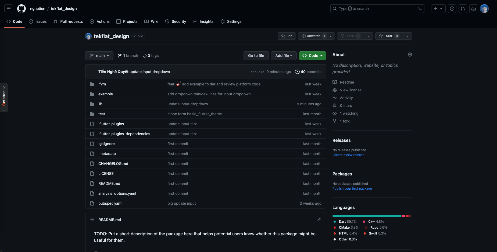

<!--
This README describes the package. If you publish this package to pub.dev,
this README's contents appear on the landing page for your package.

For information about how to write a good package README, see the guide for
[writing package pages](https://dart.dev/guides/libraries/writing-package-pages).

For general information about developing packages, see the Dart guide for
[creating packages](https://dart.dev/guides/libraries/create-library-packages)
and the Flutter guide for
[developing packages and plugins](https://flutter.dev/developing-packages).
-->

<p align="center">
  <a href="https://teko-flat-design.web.app/">
    
  </a>
</p>

<h1 align="center">Teko Flat Design</h1>

<div align="center">

A TEKO FLAT DESIGN framework designed for Web, Android, IOS, MACOS, Linux, Window application, contains some high quality widgets.

</div>

[](https://teko-flat-design.web.app/)

## ✨ Features

- 🌈 Enterprise-class UI designed for Web, Android, IOS, MACOS, Linux, Window applications.
- 📦 A set of high-quality Flutter widgets out of the box.
- 🛡 Written in pure Dart with null safety.

## 🖥 Environment Support

- Working on Windows and Mac OS

## 📦 Install

```bash
flutter pub add tekflat_design
```

## 🔨 Usage

```dart
import 'package:tekflat_design/tekflat_design.dart';

void main() {
    runApp(
        const FlatterApp(
            home: Scaffold(
                body: Center(
                    child: TekButton(
                        onPressed: () {},
                        text: 'Click me'
                    ),
                ),
            ),
        ),
    );
}
```

### Null Safety

`tekflat_design` is written in dart with null safety.

## 🔗 Links

- [Home page](https://teko-flat-design.web.app/)
- [Widgets Overview](https://teko-flat-design.web.app/docs/overview)

## ⌨️ Development

Use GitHub, a free online dev environment for GitHub.

[](https://github.com/nghetien/tekflat_design)

Or clone locally:

```bash
$ git git@github.com:nghetien/tekflat_design.git
$ cd tekflat_design
$ flutter pub get
$ flutter run
```

Now flutter will run on the connected device in your environment.

## 🤝 Contributing

We welcome all contributions. You can submit any ideas as [pull requests](https://github.com/nghetien/tekflat_design) or as [GitHub issues](https://github.com/nghetien/tekflat_design/issues).



## ❤️ Sponsors and Backers
